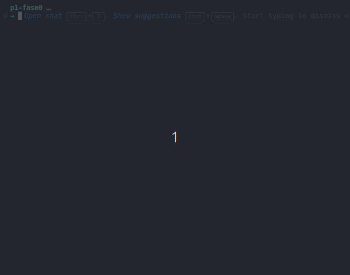
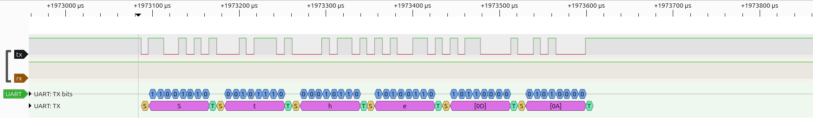
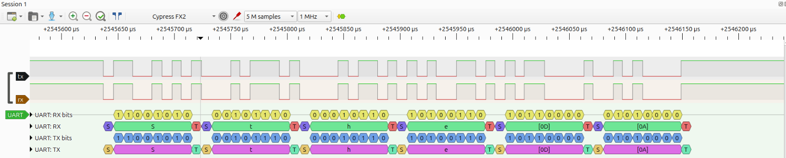

# RP2040 Bare-Metal Hardware Validation Lab


> Validação arquitetural e física do RP2040 em ambiente bare-metal completo — sem Pico SDK, sem abstração. Base técnica para o [P1 SWD Forensic Extractor](https://github.com/StheffannyNAlves/swd-forensic-extractor).

---

## Por que este repositório existe

Antes de construir uma sonda forense que controla hardware externo via protocolo SWD, era necessário responder uma pergunta anterior:

**É possível inicializar e operar o RP2040 de forma previsível e verificável, acessando apenas registradores, sem nenhuma biblioteca intermediária?**

Este repositório documenta a resposta experimental a essa pergunta. O objetivo não foi construir um firmware final nem maximizar produtividade, mas validar cada subsistema do chip de forma isolada, com evidência funcional e elétrica.

Os aprendizados desta fase informaram diretamente as decisões de arquitetura do projeto principal, em especial a separação entre o que é responsabilidade do SDK e o que exige controle bare-metal.

---

## O que foi validado

| Subsistema | Implementação | Evidência |
| ------------ | -------------- | ----------- |
| Cadeia de boot | `BootROM → boot2 → Reset_Handler → main()` | Execução confirmada |
| Linker script | Organização explícita de FLASH e RAM, VMA/LMA | `readelf`, `objdump` |
| Runtime (`crt0`) | Pilha, cópia de `.data`, limpeza de `.bss` em Assembly | Inspeção de memória |
| Clock tree | XOSC 12 MHz, seleção manual de `clk_ref` e `clk_sys` | Operação da UART |
| GPIO via SIO | Registradores atômicos `GPIO_OUT_SET`/`CLR` | Sinal observado |
| UART bare-metal | `FUNCSEL`, `IBRD`/`FBRD`, FIFOs TX/RX | Terminal + analisador lógico |
| PADS | Pull-up, Schmitt trigger, correção de linha flutuante | Captura lógica |

---

## Arquitetura validada

### Fluxo de boot

```text
BootROM (ROM interna)
  └→ boot2 (256 bytes em 0x10000000 — segundo estágio)
       └→ Reset_Handler (crt0 em Assembly)
            ├── configura stack pointer
            ├── copia .data de FLASH para RAM
            ├── zera .bss
            └→ main()
```

### Modelo de memória

```text
FLASH (0x10000000)
├── 0x10000000  .boot2       (256 bytes — injetado via .incbin)
└── 0x10000100  .text        (código — executado em FLASH)
                .rodata      (constantes)
                .data (LMA)  (dados mutáveis — armazenados em FLASH)

RAM (0x20000000)
├── .data (VMA)   (copiado de FLASH pelo crt0)
├── .bss          (zerado pelo crt0)
└── stack         (cresce para baixo)
```

A distinção entre **VMA** (endereço de execução) e **LMA** (endereço de armazenamento na imagem) foi validada inspecionando o ELF gerado com `readelf -S` e confirmando que o `crt0` copiava corretamente o segmento `.data` antes de chamar `main()`.

### Clock tree

```text
XOSC (12 MHz cristal externo)
  └→ clk_ref  (configurado manualmente via CLKSRC)
       └→ clk_sys (roteado para os periféricos)
```

A estabilização do XOSC foi aguardada por polling do bit `STABLE` antes de prosseguir, sem isso, a UART operaria com clock incorreto e produziria dados corrompidos.

---

## Estrutura do projeto

```text
uart-baremetal-rp2040/
├── src/
│   ├── start.s          ← Reset_Handler: crt0 mínimo em Assembly
│   ├── main.c           ← aplicação: clock tree, GPIO, UART
│   └── boot2_final.S    ← segundo estágio de boot (injetado via .incbin)
├── linker/
│   └── memmap.ld        ← script de link: seções, símbolos, VMA/LMA
├── tools/
│   ├── boot2.bin        ← binário do boot2 pré-compilado
│   └── uf2conv.py       ← conversão BIN → UF2
├── docs/
│   ├── uart-echo.gif    ← evidência 1: comunicação serial reativa
│   ├── uart-waveform.png ← evidência 2: captura lógica TX/RX
│   └── testecomloopback.png ← evidência 3: loopback físico
└── .github/workflows/   ← pipeline de build automático
```

---

## Como compilar

### Requisitos

| Ferramenta | Versão testada |
| --- | --- |
| `arm-none-eabi-gcc` | 13.2 |
| `cmake` | ≥ 3.13 |
| `ninja` | qualquer |
| `python3` | ≥ 3.8 |

### Build

```bash
git clone https://github.com/StheffannyNAlves/uart-baremetal-rp2040.git
cd uart-baremetal-rp2040

cmake -S . -B build -G Ninja
cmake --build build --verbose
```

### Artefatos gerados

```text
build/
├── firmware.elf   ← inspecionar com readelf / objdump
├── firmware.bin   ← imagem binária bruta
└── firmware.uf2   ← para arrastar para o Pico em modo BOOTSEL
```

### Conversão para UF2

```bash
python3 tools/uf2conv.py -c build/firmware.bin -b 0x10000000 -f 0xe48bff56 -o build/firmware.uf2
```

### Teste serial

```bash
# Linux
picocom -b 115200 /dev/ttyUSB0

# Verificar porta disponível
ls /dev/ttyUSB* /dev/ttyACM*
```

---

## Metodologia de validação

A validação foi conduzida de forma incremental, isolando um subsistema por vez antes de integrá-lo ao restante.

### Estratégia

```text
1. Inspeção estática do ELF (readelf, objdump)
     └→ confirmar seções, endereços, símbolos
2. Validação do layout de memória
     └→ VMA/LMA coerentes com o linker script
3. Teste de transmissão UART (TX → terminal)
     └→ confirmar baudrate e ausência de corrupção
4. Teste de recepção UART (RX sem loopback)
     └→ confirmar linha estável em repouso após ajuste de PADS
5. Teste com loopback físico (TX → RX)
     └→ isolar FIFOs e confirmar integridade temporal
6. Captura com analisador lógico
     └→ validar start bit, dados, stop bit e timing
```

---

## Evidências experimentais

### Evidência 1 — Comunicação serial reativa

O RP2040 executando firmware bare-metal em modo eco, conectado a um terminal externo via `picocom`. A string `UART` aparece no terminal, confirmando que o chip inicializou corretamente, configurou a UART e está transmitindo via acesso direto às FIFOs.

**Configuração:** `115200 8N1`, sem controle de fluxo, sem loopback físico.



---

### Evidência 2 — Integridade de sinal em nível de fio

Captura direta de TX e RX com analisador lógico Hantek 6022BL (DSView), sem loopback físico e sem driver externo na linha RX. O decoder UART do DSView decodifica os bytes transmitidos e confirma:

- presença de start bit, 8 bits de dados e stop bit coerentes com `8N1`
- TX operando no baudrate esperado
- RX estabilizada em nível alto após configuração de pull-up e Schmitt trigger nos PADS

> **Nota:** a linha RX flutuava antes do ajuste dos PADS, causando recepção de lixo. A correção exigiu habilitar pull-up interno e Schmitt trigger via registradores `PADS_BANK0`, acesso direto, sem SDK.



---

### Evidência 3 — Validação de FIFOs por loopback físico

TX conectado diretamente a RX. O RP2040 transmitia a string `"shahe\r\n"` e validava a recepção local byte a byte. A captura confirma:

- espelhamento consistente entre TX e RX com delay mínimo
- operação simultânea das FIFOs sem perda
- integridade temporal compatível com `115200 8N1`
- os bytes decodificados pelo DSView em TX e RX são idênticos e correspondem à string transmitida



---

## Limitações identificadas

### Gargalo de throughput da UART

O protocolo `8N1` consome 10 bits físicos por byte útil. A `115200 bps`:

```text
throughput efetivo = 115200 / 10 = 11.520 bytes/s = ~11,25 KB/s
tempo para 2 MB   = 2.097.152 / 11.520 ≈ 182 segundos (~3 minutos)
```

Isso é **3× acima da meta de 60 segundos** para o dump forense. Além disso:

- UART é mais sensível a ruído em cabos longos
- não há controle de fluxo nativo adequado para volumes grandes
- latência de handshake manual por software aumenta o overhead

### Conclusão

A UART foi adequada como canal de diagnóstico e validação. Para o objetivo forense final, 2 MB em menos de 60 segundos, é inadequada como canal principal de transporte.

---

## O que esta fase ensinou e como isso mudou o projeto

Cada decisão da arquitetura híbrida do projeto principal tem origem direta nesta fase.

**Registradores atômicos do SIO**: validados aqui com GPIO e UART. A mesma lógica se aplica ao SWD no projeto principal: `GPIO_OUT_SET`/`CLR` em vez de `gpio_put()` porque leitura-modificação-escrita é insegura em contexto com interrupções.

**Separação SDK/bare-metal**: o SDK foi deliberadamente excluído aqui para entender o que ele faz por baixo. Com esse entendimento, a decisão no projeto principal ficou clara: SDK para transporte USB (sem requisito de timing preciso), bare-metal para os pinos SWD (timing crítico em microssegundos).

**UART como diagnóstico, USB como transporte**: o gargalo calculado acima é a justificativa quantitativa para usar TinyUSB CDC no projeto principal. Não foi uma escolha arbitrária.

---

## Relação com o projeto principal

Este repositório é a **Fase 0** de uma sequência de dois projetos:

```text
uart-baremetal-rp2040 (este repositório)
  └→ Pergunta: é possível controlar o RP2040 sem SDK?
  └→ Resposta: sim, com evidência funcional e elétrica

swd-forensic-extractor (projeto principal)
  └→ Pergunta: é possível extrair firmware de outro RP2040 via SWD,
               com integridade forense verificável?
  └→ Construído sobre o que foi aprendido aqui
```

→ **[Ver projeto principal: P1 SWD Forensic Extractor](https://github.com/StheffannyNAlves/swd-forensic-extractor)**

---

## Referências

- [RP2040 Datasheet](https://datasheets.raspberrypi.com/rp2040/rp2040-datasheet.pdf) — §2.3.1 (SIO), §2.15 (Clocks), §4.2 (UART), §4.7 (Watchdog)
- [ARMv6-M Architecture Reference Manual](https://developer.arm.com/documentation/ddi0419/latest) — vetor de reset, modelo de memória
- [GNU LD Manual](https://sourceware.org/binutils/docs/ld/) — linker scripts, VMA/LMA, seções

---

*Desenvolvido por [Stheffanny N. Alves](https://github.com/StheffannyNAlves)*
